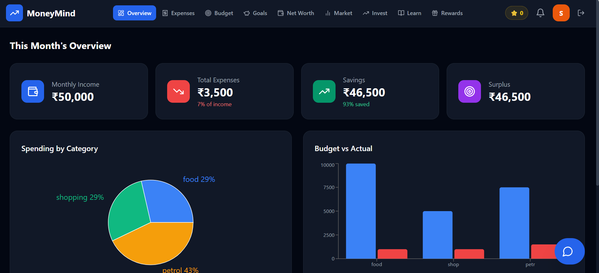
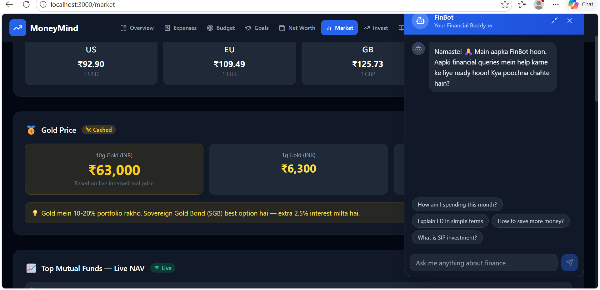
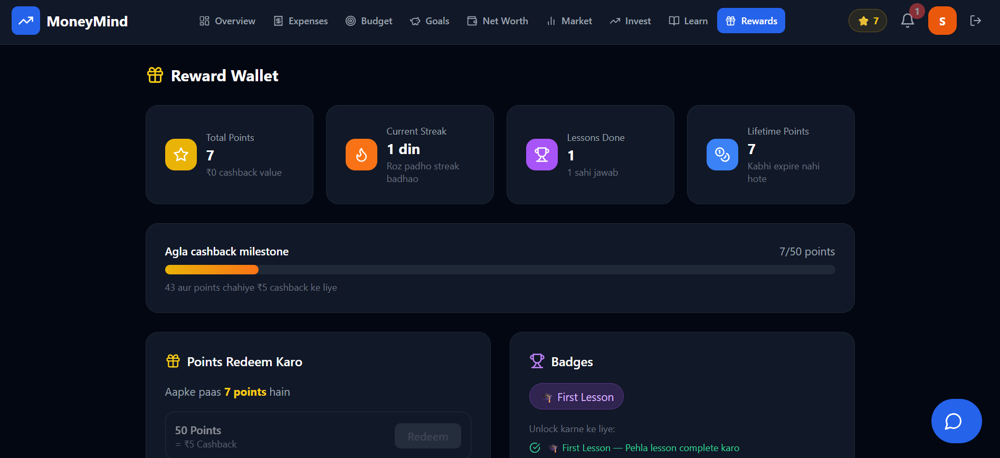
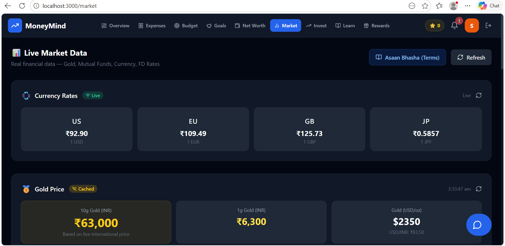

# 🚀 MoneyMind: Your Personal Indian Finance Guru

> **Empowering individuals to manage, grow, and truly *understand* their finances through AI, Gamification, and Localized (Hinglish) Financial Literacy.**


**🟢 Live Demo:** [https://moneymind-sakshi.netlify.app](https://moneymind-sakshi.netlify.app)

**🔑 Test Credentials (For Judges):**
- **Email:** test@example.com *(Yahan aap kisi dummy account ka email daal dena jo aapne banaya ho)*
- **Password:** 123456

## 🎯 The Problem We Are Solving
While there are hundreds of budget trackers out there, most of them lack two critical things: **Personalized Financial Guidance** and **Understandable Financial Literacy**. Complex financial jargon intimidates the average Indian user. 

**MoneyMind** bridges this gap. It doesn't just track your expenses; it acts as a friendly Indian financial advisor. It uses a conversational "Hinglish" tone and real-life examples (like "Gullak" for SIPs and "Stepney" for Emergency Funds) to teach users how to grow their wealth.

---

## 🏆 Alignment with Hackathon Themes

### 1. 📊 Budget Tracking (Smart & Proactive)
* **AI Month-End Summaries:** Generates personalized action plans to reduce spending in top categories.
* **Proactive Alerts:** Smart push notifications when users hit **70%, 90%, and 100%** of their monthly budget target.
* **Overview Dashboard:** Beautiful visual insights (Recharts) into income, surplus, and category-wise spending.

### 2. 💡 Investment Guidance (Built on Real Data)
* **AI Financial Planner:** Users input their salary and expenses, and the AI generates a customized investment plan (50-30-20 rule) with a Financial Health Score.
* **Live Market Data:** Real-time data fetching for Gold Prices, Mutual Fund NAVs, Currency Rates, Fixed Deposits, and Government Schemes (PPF, SSY).

### 3. 🎓 Financial Literacy (Our Biggest USP)
* **Daily Finance Lessons:** bite-sized, gamified daily lessons in simple Hinglish with MCQ quizzes.
* **Gamification & Rewards:** Users earn points, build streaks, and unlock badges (e.g., '🧠 Quiz Master', '🔥 Week Streak') for learning about finance.
* **Asaan Bhasha (Glossary):** A dedicated dictionary that explains complex financial terms using relatable Indian contexts.
* **FinBot (AI Chatbot):** A 24/7 AI companion ready to answer financial queries in simple language.
* **Market News:** Real-time Indian financial news updates embedded directly in the app.

---

## 🧠 The "Secret Sauce" (Why Judges Will Love This)

1. **Localized Indian Context (Hinglish):** The app speaks the language of the masses, making financial education highly accessible and non-intimidating.
2. **🌟 Smart API Fallbacks (Zero Crash Guarantee):** We understand that APIs can fail or hit rate limits. If the Gemini AI API fails (or if the API key is not provided during evaluation), the app **gracefully falls back to a robust, pre-calculated, hardcoded rule-based system**. The UI never breaks, and the user continues to get contextual advice!

---

## 🛠️ Tech Stack
* **Frontend:** React.js, Tailwind CSS, Recharts, Lucide Icons
* **Backend:** Node.js, Express.js
* **Database:** MongoDB (Mongoose)
* **AI Integration:** Google Generative AI (Gemini 2.0 Flash)
* **Authentication:** JWT (JSON Web Tokens)

---

## 🚀 How to Run the Project Locally

### Prerequisites
* Node.js installed
* MongoDB instance (Local or Atlas)

### Step 1: Clone and Setup Backend
```bash
cd server
npm install
```
Create a `.env` file in the `server` directory:
```env
PORT=5000
MONGO_URI=your_mongodb_connection_string
JWT_SECRET=your_super_secret_key
GEMINI_API_KEY=your_gemini_key # (Optional: App uses Smart Fallbacks if left empty!)
```
Start the backend server:
```bash
npm run dev
```

### Step 2: Setup Frontend
```bash
cd client
npm install
```
Start the React app:
```bash
npm start
```
The app will be running at `http://localhost:3000`.

---

## 📸 Features Gallery

### 📊 Dashboard & Spending Analytics


### 🤖 FinBot Chat Interface


### 🎓 Daily Lesson & Reward Wallet


### 📈 Live Market Data & Glossary


---

## 💡 Future Scope
* **Bank Account Integration:** Using Account Aggregator (AA) frameworks for automated expense fetching.
* **Multilingual Support:** Expanding from Hinglish to regional languages like Marathi, Tamil, and Bengali.
* **Direct Investments:** Allowing users to directly start SIPs or buy Digital Gold from within the app.

---
Made with ❤️ for the Hackathon.